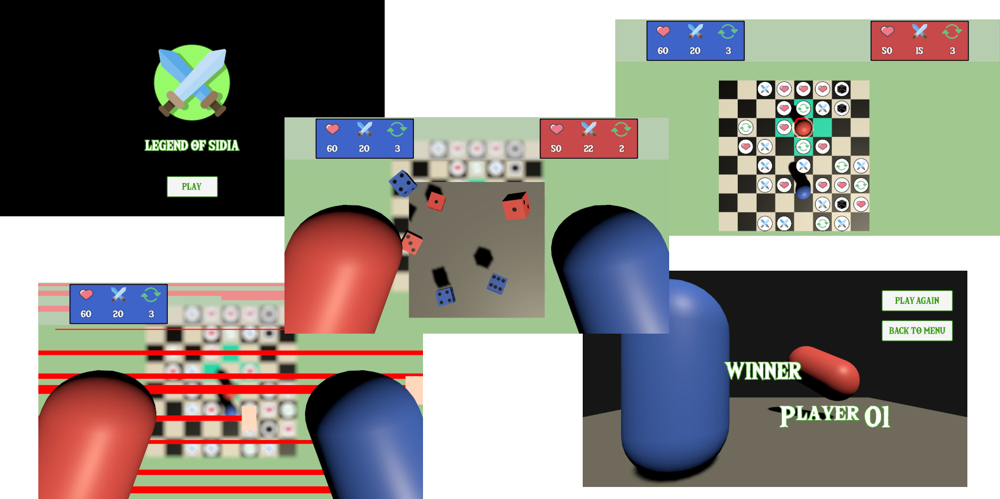

# LegendOfSidia
Technical Challenge from Sidia's Interviewing Process

	

## FEATURES

- [x] Menu Scene
- [x] Board with Square Tiles
- [x] Custom Board Creation with different sizes
- [x] Player vs Player Gameplay
- [x] Players acts on turns of 3 movements
- [x] Player Controlled by Mouse
- [x] Each Character has different settings
- [x] Players can move to adjacent Tiles
- [x] Players can't occupy same tile as other player
- [x] Player next possible moves highlight
- [x] Player hovered tile highlight
- [x] Smooth Follow Camera 
- [x] Camera Distance controlled by mouseScroll
- [x] Added Extra Move Collectable
- [x] Added Extra Attack Collectable
- [x] Added Extra Dice Collectable
- [x] Added Health Recover Collectable
- [x] Create dynamic and customizable Collectables on board
- [x] Collectables are refilled on 10% left
- [x] Health and Attack Collectables has dynamic bonus points
- [x] Battle with adjacent players
- [x] Physically based dice roll mechanic
- [x] Dices has the owner player's color
- [x] Six Sided Dices (Easy to add dices with different number of sides)
- [x] Battle with 3 or more (depending on bonus) dices for each player
- [x] Battle decided over comparing the 3 highest dices values of each player
- [x] Player owner of the turn win dice draws
- [x] Player attack on end of dice roll
- [x] Each Collectable has its own Sound Effect
- [x] Battle has Sound Effects and SoundTrack
- [x] Particle Effect for Collectables
- [x] Particle Effect for battle
- [x] Each Scene has its own SoundTrack
- [x] End Game Scene that display the winner
- [x] Option to PLAY AGAIN or go BACK TO MENU in End Game Sceneitem

